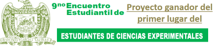

# Presentacion del proyecto Feria de CIencias UAP UAZ 2023 cozcyt

## Fecha: 17 y 18 de Mayo del 2023
## Ubicacion: Cozcyt Zacatecas
## Evaluador:  Dr en C. Hamurabi Gamboa Rosales, Director Gneeral del Cozcyt

    En su primera exposicion formal, el sistema de electrodepuracion trifasica arranco de una manera impresionante, pues en aquella exposicion, aun siendo que el proyecto estaba en 
    una etapa muy temprana destaco por la extensa recopilacion de datos y el prototipo funcional presentado, mas que por eso, por lo impresionante que resultaba la idea de que un sistema
    de purificacion pudiera funcionar con energia sustentable y no generara residuos, tras la evaluacion del Dr, Hamurabi se determino necesario conducir mas estudios que se adentraran 
    en el uso de desinfectantes quimicos y su impacto en la sanidad del agua, asi entonces se podria obtener la patente del sistema, lo que ha sido la meta del proyecto desde entonces.

## Aspectos a destacar 
- El proyecto obtuvo el primer lugar en la exposicion, recompensa, 20 USD
- El autor forzo una bodega rompiendo el cristal de la puerta pues antes de la exposicion se habia almacenado el inventario en ella, y no habia llave :b 
- Se tuvo por primera vez en consideracion la obtencion de una patente 