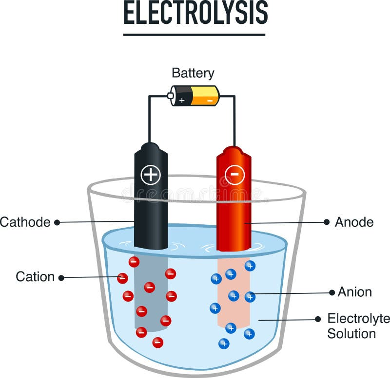

# Aplicabilidad
    Si se consulta el apartado de los basicos de la pureza del agua,o cualquier articulo de la misma indole, no es necesario indagar mucho en el evidente echo de la necesidad del desarrollo de nuevos procesos de purificacion del agua que logren extender su vida util al integrarse en el ciclo de vida de los seres organicos, como se ha mencionado, en las normas generales de sanidad del agua se estipula que tras ser sometida a un proceso de purificacion, el agua debe estar libre de compuestos solidos, reactivos y patogenos que puedan llegar a afectar de manera negativa la salud del consumidor, en la actualidad el consumo de agua purificada al menos en la region latinoamericana, es a travez de agua embtella en disintas prsentaciones, esto debido principalmente a la inviabilidad economica a largo plazo de poseer un purificador de agua casero, y siendo que en el caos de poseer alguno, estos generalmente no logran cumplr con el nivel de purificacion requerido para garantizar la salud de sus consumidores, tomemos por ejemplo a los purificadores de filtro de torre, estos por lo general estan destinados a neutralizar los reactivos en el agua que pudiesen llegar a resultar daninos para la salud, pero esto considerando que el aguade entrada no tuviera la presecnecia de solidos que no sean facilmente filtrables, como es el caso de los filtros de torre con el agua de llave en la region de prueba, aun cuando el filtro retire los compuestos no deseados en el agua, persistira la prescencia de compuestos solidos que loas capas porosas de filtro no ha sido capaz de filtrar, como lo son algunos compuestos quimicos como el mercurio, que al poseer un punto de fusion bajo es dificil de retirar mendiante filtracion, es por esto que el metodo de retencion por electrolsis es mas efectivo para este tipo de aplicaciones, en las que la calidad del agua conlleva a que se clasifique como inviable su tratamiento, pero al no haber otras fuentes de agua disponibles se consume aquella que contiene contaminantes, asi tambien, otro problema moderno en el tratameinto del agua es la desmineralizacion del agua, en el que en plantas de tratamiento que utilizen medotos de filtracion mas agresivos, el agua suave resulta ser carente de minerales escenciales para la nutricion tales como lo son el calcio, magnesio y zinc, por lo tento el agua no cuenta con los electrolitos necesarios para hidratar al consumidor y por lo tanto este terminara por agregar compuestos procesados poco saludables al agua, o consumir bebidas de rehidratacion procesadas, que en su consumo prolongado provocan problemas de salud hepaticos, por esto es de vital importancia regular el nivel de 
    suavizacion al que se somete el agua de entrada.

    Pasando al proceso de desinfeccion, tomando de ejemplo primeramente a los de aplicacion industrial como lo son el de UV y destilacion, que ademas de consumir una gran cantidad de energia electrica, derviando en problemas para su aplicabilidad sustentable, generan problemas en la composicion del agua de salida, como lo son la radiacion excesiva ocasinal, la cual es del tipo altamente riesgosa para la salud y la perdida de una parte importante del agua, respecitivamente, por eso la implementacion de una desinfeccion por medio de compuestos quimicos es lo mas viable en trerminos generales, ademas de ser objetivamente mas economico, he de alli que sea la opcion mas utilizada para la desinfeccion del agua en el hogar, en la actualidad,el quimico mas utilizado para deisnfectar agua o alimentos que se limpien con agua como las frutas y verduras, es la plata coloidal o sus derivados, y siendo que el segundo paso del sistema de eletrodepuracion trifasica la produccion de este proceso, resalta su viabilidad tanto economica como energetica pues en general para producir este compuesto solo es necesario de una cantidad infima de agua tridestilada y un sistema de electrodos de plata, como el que utiliza el sistema, siendo asi que, si bien criticado por ser un compuesto ampliamente utilziado en medicina alternativa, la plata coloidal resalta inegablmente como la opcion mas viable para la desinfeccion del agua.
    
    En la actualidad, el aspecto general de la ingenieria en materia de sustentabilidad se enfoca principalmente en los aspectos de origen y final de la vida util de las cosas, en este caso nos enfocamos mas en el aspecto de la duracion y el final de la vida util de los componentes del sistema, siendo los que mas contaminan a largo plazo son los desechos de metal como lo son los diodos del sistema, por esto mismo se implemento el procesos de electropulido en el sistema para lograr elimianr en medida de lo posible la necesidad de remplazar los componentes no biodegradables del sistema, volviendolo mas viable en materia de sustentabilidad economica y ambiental.

    Con estos puntos en mente se determina que la aplicabilidad tanto en el uso domestico de areas con acceso reducido al agua potable o en la aplicacion industrial para ditribuir agua potable a poblaciones de mayor tamaño se cumple satisfactoriamente y vale la pena desarrollar un sistema de esta indole. 

# 